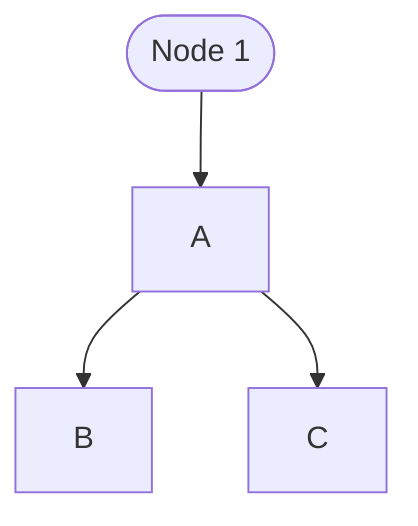

# آموزش مارک‌داون

بر اساس آموزش بی‌نظیر
[گیت‌هاب](https://github.com/adam-p/markdown-here/wiki/Markdown-Cheatsheet).

با یک سری نکته بیشتر برای فرمول نویسی و کشیدن نمودار و درج ایموجی و فارسی نوشتن.

## متن ساده

زبان مارکداون روی نوشتن سریع و خوانایی کد حتی بدون رندر شدن تمرکز دارد. برای نوشتن متن‌های نرمال مثل همین متن صرفا در هر جایی متن خود را تایپ کنید.

پاراگراف ها با دو بار به خط بعد رفتن مشخص می‌شوند. برای همین می‌توانید برای به هم نریختن متون قسمت‌های فارسی و انگلیسی را با یک خط فاصله در کد از هم جدا کنید و در نسخه رندر شده پاراگراف بگیرید.

## عناوین و سرفصل‌ها

برای مشخص کردن و جدا کردن قسمت‌های مختلف متن و سرفصل‌ها از `#` استفاده کنید.

```markdown
# عنوان ۱

## عنوان ۲

### عنوان ۳

#### عنوان ۴

##### عنوان ۵

###### عنوان ۶
```

کد بالا به صورت زیر نمایش داده می‌شود:

# عنوان ۱

## عنوان ۲

### عنوان ۳

#### عنوان ۴

##### عنوان ۵

###### عنوان ۶

> استاندارد مارک‌داون برا این است که تنها یک بار از عنوان درجه ۱ استفاده کنیم.

## حالت دادن متن

می‌توانید متن خود را
**پررنگ**
و
_ایتالیک_
و
**حتی _ترکیبی_ از هر دو**
کنید.
علاوه بر اینها می‌توانید
_زیر متن خط بکشید_
یا
~~خود متن را خط بزنید~~
.

کد هر یک از حالتهای بالا به صورت زیر است:

```markdown
_italic_
**bold**
_underlined_
~~strikethrough~~
```

## لیست‌ها

می‌توانید لیست‌های شماره‌گذاری شده، بی ترتیب و حتی تو در تو داشته باشید.

برای نوشتن یک لیست شماره دار صرفا قبل از شروع خط شماره را به صورت شماره و نقطه
(`.1`)
اضافه کنید.

برای لیست بدون ترتیب از ستاره و منفی می‌توان استفاده کرد.

برای لیست‌های ترکیبی درون روی لیست را با نقطه مشخص کنید.

## لینک

برای درج لینک از حالت زیر استفاده کنید. مقصد می‌تواند فایل‌های محلی یا مقصدی آنلاین باشد.

میتوانید بدون شکستن خطوط در آنها لینک درج کنید.

> در نظر داشته باشید بعضی مرورگرها لینک‌ها را برای دلایل امنیتی باز نمی‌کنند.

کد لینک:

```markdown
[link title](link destination)
[google](www.google.com)
```

مثال از یک
[لینک](assets/markdown.png)
در متن.

## درج تصاویر

دقیقا مثل درج لینک، فقط قبل از براکت اول یک علامت تعجب بگذارید.

کد زیر

```markdown

```

به این شکل نمایش داده می‌شود:


همچنین می‌توانید بدون شکستن پاراگراف چند تصویر متوالی داشته باشید:


## کد

برای نوشتن کد دو حالت دارید:

- برای نوشتن کد در خط آنرا با ` محصور کنید.
- برای نوشتن کد چند خطی قبل و بعد از خطوط کد سه تا ` بگذارید.

برای اینکه
syntax highlighting
هم داشته باشید خط اول بعد از علامت شروع بلوک کد اسم زبان را بنویسید.

مثال:

```python
# this is some python code
for i in range(3):
    print(i**2)
```

## فرمول‌های ریاضی

برای نوشتن فرمولهای ریاضی آنرا با
`$`
برای فرمولهای درون خط و
`$$$`
برای فرمولهای بزرگ مشخص کنید و با سینتکس Latex فرمول را بنویسید.

مثال:

```markdown
$$ \binom{n}{r} = \frac{P^n_r}{r!} = \frac{ \frac{n!}{(n-r)! }}{r!} $$
```

فرمول زیر را نمایش می‌دهد:

$$ \binom{n}{r} = \frac{P^n_r}{r!} = \frac{ \frac{n!}{(n-r)! }}{r!} $$

## جدول

برای نمایش ددن جدول باید اول ردیف سری آنرا بنویسید و عناوین را با
`|`
جدا کنید.
سپس در خط بعدی به فرم زیر عناوین را جدا کنید:

کد:

```markdown
| نام  | نام خانودادگی | سن  |
| ---- | ------------- | --- |
| محمد | احمدی         | ۲۳  |
| عباس | همایون        | ۳۵  |
```

جدول زیر را می‌دهد:

| نام  | نام خانودادگی | سن  |
| ---- | ------------- | --- |
| محمد | احمدی         | ۲۳  |
| عباس | همایون        | ۳۵  |

> نکته: برای نوشتن جدول لازم نیست حتما در کد هم فاصله داده شود. صرفا قسمت‌ها را از هم جدا کنید و در نهایت با یک فرمت کننده اتوماتیک جدول را فیکس کنید.

## نکات

برای درج بلوکهای نکته در متن از
`<`
استفاده کنید.

کد:

```markdown
> همیشه کد خود را ذخیره کنید!
```

این باکس را تولید می‌کند:

> همیشه کد خود را ذخیره کنید!

می‌توانید با افزونه‌هایی مثل
[Markdown Extended](https://marketplace.visualstudio.com/items?itemName=jebbs.markdown-extended)
این باکس ها را متنوع تر کنید. باکسهای زیر با این افزونه و به شکل زیر ساخته شده‌اند:

```markdown
!!! danger هشدار!
    پسورد خود را به کسی نگویید.

!!! note نکته
    همیشه کامنت بگذارید.
```

!!! danger هشدار!
    پسورد خود را به کسی نگویید.

!!! note نکته
    همیشه کامنت بگذارید.

## HTML

هر جایی که نیاز داشته باشید می‌توانید از المانهای
HTML
استفاده کنید.

```markdown
<div id="32261390254"><script type="text/JavaScript" src="https://www.aparat.com/embed/NAGfI?data[rnddiv]=32261390254&data[responsive]=yes"></script></div>
```

<div id="32261390254"><script type="text/JavaScript" src="https://www.aparat.com/embed/NAGfI?data[rnddiv]=32261390254&data[responsive]=yes"></script></div>

## دیاگرام

برای درج نمودارها می‌توانید از کد
mermaid
در یک بلوک استفاده کنید.

مثلا کد زیر:

```
graph
    A --> B
    A --> C
     id1([Node 1]) --> A
```

نمودار زیر را تولید می‌کند:


